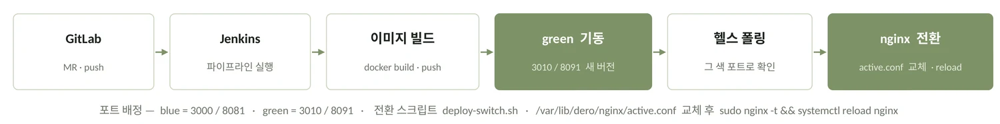

# DERO — 데스크테리어 3D 시뮬레이터

> 제품을 고르는 화면과 내 책상에 놓아보는 화면을 하나로 합친 서비스. EC2 한 대에서 무중단 배포까지 끌고 갔습니다.

| | |
|---|---|
| 기간 | 2026.07 – 08 (6주) |
| 팀 | 5인 · 팀원 · 기여도 40% |
| 나의 역할 | 프로젝트 기획(PM) · 백엔드 · 클라우드 인프라 · CI/CD · 관측 |
| 성과 | SSAFY 공통 프로젝트 경진대회 우수상 · 서비스 운영 중 |

`3D · Infra`  `Spring Boot`  `Three.js`  `Jenkins`  `Elasticsearch`  `SSAFY 공통 프로젝트 경진대회 우수상`

## 개요

### Problem · Evidence

데스크테리어 제품은 크기와 조합에 따라 실제 배치 결과가 달라집니다. 그런데 구매 전에 확인할 수 있는 건 제품 이미지와 상품 정보뿐이라, **“내 책상에 맞을까”를 실측과 감으로 판단**해야 했습니다.

**77명 조사**에서 탐색보다 **배치를 미리 보는 경험**을 원했습니다. 시장은 **2025년 114억 달러 · 연 6.9% 성장**, 퍼시스 ‘데스커’는 **매출 1,000억**. 수요는 있는데 확인 수단이 없었습니다.

오늘의집 같은 인테리어 커머스는 ‘완성된 공간 사진’을 보여줄 뿐 **‘내 책상’ 단위의 사전 검증**을 하지 않고, 기존 3D 배치 서비스는 방 전체 스케일이라 데스크 단위 호환성을 다루지 않습니다.

### 나의 활동 — 팀 리딩

각자 무엇을 하는지 주 단위로만 알 수 있어 겹치는 작업과 대기가 생겼습니다. 사람이 아니라 구조 문제였습니다 — 업무 단위가 ‘기능’이라 병렬화가 안 됐습니다.

월요일 아침 스프린트 시작 · 주간/데일리 스크럼 · Jira 이슈 컨벤션 + 담당자 배정 + 스토리 포인트 산정 · API 명세 사전 정리 · 업무 병렬화를 제안했습니다. 용어를 몰랐던 **DX 프로젝트 때 스스로 쓰던 방식**을 팀 절차로 올린 것입니다.

요구 기능은 셋이었습니다 — **① 모니터암 관절이 실제로 움직일 것 · ② 조명이 조명처럼 보일 것 · ③ 부품에 따라 책상 위가 아니라 벽면·타공판에도 붙을 것**. 여기에 폴리곤·텍스처 최적화가 따라붙었습니다.

셋 다 **모델을 뽑고 나서 고칠 수 있는 일이 아니었습니다.** 관절 축도 재질도 부착면도 모델 구조가 정해지는 순간 같이 정해집니다. 그래서 요구마다 **프로토타입을 따로 만들어 먼저 확인한 뒤에** 본 모델을 뽑았습니다. 이 프로젝트의 POC 습관은 여기서 나왔습니다.

결과: 요구 기능이 **3개에서 6개로 늘었을 때**도 기존 세 개의 확장이라 스토리 추가만으로 대응했고 일정 지연이 없었습니다. 이후 프로젝트도 같은 방식으로 시작합니다.

### 핵심 성과 · Key Achievements

- **GLB 38MB → 378KB** POC 실측으로 소품당 **20K~50K 삼각형** 예산을 잡고 텍스처 프로필 3단계(21.3 / 42.6 / 47.9 MiB)를 비교해 MVP 기본값을 고정 — 원본 대비 **약 1/100**

- **배포 다운타임 수 초 → 0** 호스트 nginx에 포트가 하드코딩돼 제자리 교체되던 구조를 **blue-green**으로 재설계. health 폴링을 통과해야만 트래픽이 넘어가고, 실패하면 아무 일도 일어나지 않음

- **요구 3개 → 6개, 일정 지연 0** 관절 · 조명 · 부착면 세 요구를 **각각 프로토타입으로 먼저 검증**한 뒤 스프린트 · Jira 스토리 포인트로 업무를 재편 — 요구가 두 배로 늘었을 때도 기존 셋의 확장이라 **스토리 추가만으로 대응**했습니다

성과 2건 더 보기

- **핵심 기능 검증 7일 → 3일** 난도가 높은 GLB 변환·렌더링을 전체 개발 전에 POC로 떼어내 먼저 검증했습니다

- **최소 권한 배포** 컨테이너를 **127.0.0.1 바인딩**으로 묶어 3000·8081 평문 노출 제거, jenkins에는 `nginx -t` · `systemctl reload nginx` **두 명령만** sudo 허용

**제약을 먼저 적습니다.** EC2 **한 대**, 운영 인력 사실상 **1명**, 기간 **6주**. 아래의 모든 선택은 이 세 숫자 안에서 내려진 것이고, 조건이 달랐다면 다른 답이 나왔을 것입니다.

## 기술 의사결정

### Technical Decision

| 결정한 것 | 고른 것 | 기각한 것 | 사유 · 감수한 것 |
|---|---|---|---|
| 무중단 배포 | **blue-green** (포트 두 벌 + nginx upstream 스위치) | ① 제자리 컨테이너 교체 ② K8s 롤링 | ①은 교체 순간이 곧 다운타임. ②는 EC2 1대·운영 1명에 과합니다. *감수*: 전환 순간 두 벌이 메모리에서 겹칩니다. |
| 스키마 마이그레이션 | **Flyway expand / contract** (추가만, 삭제는 다음 배포) | V1 파일 직접 수정 | blue-green은 구·신 버전이 같은 DB를 동시에 봅니다. 직접 수정하면 green 부팅에서 `Migration checksum mismatch`로 죽습니다. *감수*: 컬럼 삭제가 한 배포 뒤로 밀립니다. |
| 3D 에셋 전달 | **서버 사전 경량화** (스마트 토폴로지 · 폴리곤·텍스처 제한) | ① 에셋 서버 분리 ② 클라이언트 원본 로딩 | ①은 인원·비용상 운영 불가. ②는 모바일 초기 로딩이 붕괴합니다. *감수*: 회전 중에는 와이어프레임으로 낮춰 표시 — 시점 고정이 목표이지 회전 중 디테일이 목표는 아니라고 봤습니다. |
| 배포 권한 | **jenkins sudoers 2개만** (`nginx -t`, `systemctl reload nginx`) | jenkins를 root로 / `/etc/nginx` 직접 쓰기 | 자동화를 위해 권한을 통째로 여는 걸 피했습니다. *감수*: EC2에 수동 세팅 단계가 남습니다. |

운영 인원이 3명 이상이고 서비스가 상시 트래픽을 받았다면, 마이그레이션 정책은 그대로 두되 배포는 관리형 오케스트레이터로 갔을 것입니다.

### Frontend 의사결정 — 왜 이걸 골랐고, 무엇을 버렸나

Q. 왜 PostgreSQL 하나인가 — MongoDB(비정형) + MySQL(정형)로 나눌 생각은 안 했나

했고, **실제로 그게 교과서적인 답처럼 보였습니다.** 그런데 우리 데이터의 조회 단위를 그려보니 안 맞았습니다.

모델 1건을 부를 때 GLB(비정형)와 관절 좌표 · VESA 규격 · 치수(정형)를 **같이** 봐야 배치 · 호환성 판정이 됩니다. 저장소를 나누면 **조회 1건에 DB 두 번**, 트랜잭션 경계도 갈라집니다.

| 선택지 | 얻는 것 | 치르는 것 | 판정 |
|---|---|---|---|
| MongoDB + MySQL 분리 | 각 데이터 성격에 최적화된 저장소 | 모델 1건 조회에 **두 저장소 왕복**. 정합성 보장 주체가 애플리케이션으로 넘어옴. 운영 대상 DB가 두 벌 | 기각 |
| PostgreSQL 단일 (JSONB 활용) | 비정형을 JSONB로 담으면서 관계형 제약·조인·트랜잭션 유지. **한 쿼리로 끝남** | 대용량 문서 저장·샤딩에서 MongoDB보다 불리 | **채택** |

**성과**모델 1건 조회가 **한 쿼리**로 끝납니다. 운영 인원 1명 기준 관리 대상 DB도 한 벌.

**감수한 것** 제품 수가 수십만 건대로 커지면 이 선택은 다시 봐야 합니다. 현재 규모에서는 병목이 아니라고 판단했고, **운영 인원 1명 기준으로 백업·모니터링·마이그레이션 대상이 하나로 끝나는 것**이 더 큰 이득이었습니다.

Q. Draco가 더 좋은데 왜 안 썼나 — 실패한 선택

**Draco가 지오메트리 압축에서 더 효율적이고 성능도 확실합니다.** 이건 우리가 더 잘 알아본 결과가 아니라 그냥 사실입니다.

문제는 조합이었습니다. 텍스처는 **KTX2**로 압축하기로 정해져 있었는데, **three.js 위에서 Draco 로더와 KTX2 로더를 같이 물리는 지점에서 연결이 매끄럽지 않았습니다.** 6주 안에 둘 다 안정적으로 붙는다는 확신이 서지 않았습니다.

그래서 **확실히 붙는 축 하나(KTX2 텍스처 압축)만** 가져가고, 폴리곤은 토폴로지 단순화로 줄였습니다.

**성과**원본 **38MB → 378KB** (약 1/100). 모바일에서 초기 로딩이 성립하게 됐습니다.

**이건 기술적 우열로 진 결정이 아니라 기간 안에 검증 가능한 범위로 물러선 결정입니다.** 시간이 더 있었다면 Draco + KTX2 조합을 먼저 시도했을 것이고, 지금 다시 한다면 그 연결부터 스파이크로 떼어내 검증하고 시작하겠습니다.

Q. 렌더 성능 예산은 어떻게 잡았나

감으로 정하지 않고 POC에서 프로필을 만들어 재고 골랐습니다.

| 텍스처 프로필 | 활성 맵 | GPU 텍스처 메모리(추정) | 적용 |
|---|---|---|---|
| **경량** | Diffuse 2K | 약 21.3 MiB | **MVP 기본값** |
| 균형 | Diffuse 2K + Normal 2K | 약 42.6 MiB | 선택 시 지연 로드 |
| 고품질 | + Roughness 1K | 약 47.9 MiB | 선택 시 지연 로드 |

함께 고정한 값: `devicePixelRatio` 상한 **1.5** · 그림자 맵 **1024×1024** · 그림자를 만드는 주 조명 **1개** · 동일 규격 지오메트리와 상판 재질 **인스턴스 재사용** · Displacement 미사용.

**성과**소품당 **20K~50K 삼각형** 예산 확정. 감이 아니라 측정값으로 기본 프로필을 골랐습니다.

**감수한 것** 고정 장면의 화질입니다. 회전 중에는 디테일을 낮추고, 정지하면 올립니다 — **시점 고정이 목표이지 회전 중 디테일이 목표는 아니라고** 봤습니다.

기술 선택 3건 더 보기

Q. 수많은 프레임워크 중에 왜 Next.js인가

**이 서비스의 유입 경로가 검색이기 때문입니다.** DERO의 성장 축은 ‘커뮤니티 게시글 → 제품 → 탐색’ 순환인데, 게시글이 검색에 걸리지 않으면 이 순환의 입구가 아예 없습니다. CSR 방식이면 크롤러가 받아가는 건 빈 HTML 껍데기입니다.

**그래서 “React를 쓰자”가 아니라 “서버사이드 렌더링을 해야 한다”가 먼저였고,** React 계열에서 SSR을 표준으로 제공하는 프레임워크가 Next.js였습니다.

| 선택지 | 얻는 것 | 치르는 것 | 판정 |
|---|---|---|---|
| Vite + React SPA | 빌드·배포가 가볍고 EC2 메모리를 덜 씀 | **SEO 포기** — 커뮤니티 유입 경로가 사라짐 | 기각 |
| Next.js (SSR) | 게시글이 검색에 노출됨. 초기 렌더가 서버에서 끝남 | Node 프로세스가 EC2 메모리를 추가로 점유. 빌드 파이프라인이 한 겹 늘어남 | **채택** |
| SSG (정적 생성) | 가장 빠르고 서버 부하 0 | 게시글·재고가 수시로 바뀌는데 매번 재빌드해야 함 | 기각 |

**성과**커뮤니티 게시글이 검색에 노출됨 — 유입 순환의 입구를 확보했습니다.

**감수한 것** EC2 한 대에 Node 런타임이 상주합니다. 이미 Jenkins·Postgres·Redis·ES가 올라간 인스턴스라 메모리 여유가 줄었습니다.

Q. 3D 에셋 파이프라인 — OBJ에서 GLB로, 그다음은

OBJ는 지오메트리·재질·텍스처가 여러 파일로 흩어집니다. 웹으로 보내려면 요청이 여러 번 갑니다. **GLB는 단일 바이너리**라 한 번에 받습니다. 그래서 먼저 OBJ → GLB로 바꿨습니다.

**그런데 GLB로 바꿔도 여전히 무거웠습니다.** POC로 실측한 조명 제품 3종입니다.

| 모델 | 파일 크기 | 삼각형 | 구조 |
|---|---|---|---|
| Amber Glow Night Light | 8.10 MB | 190,428 | 단일 노드 · 단일 메시 · 단일 재질 |
| Orange Donut Ring Light | 9.79 MB | 234,552 | 단일 노드 · 단일 메시 · 단일 재질 |
| Clamp-On Desk Lamp | 9.17 MB | 176,024 | 단일 노드 · 단일 메시 · 단일 재질 |

소품 하나에 17만~23만 삼각형입니다. **책상 위에 제품 20~30개를 동시에 올리는 게 목표**인 서비스에서는 성립하지 않습니다. POC 결과로 **소품당 20K~50K 삼각형**을 예산으로 잡았습니다.

**압축은 공짜가 아닙니다.** 인코딩·디코딩을 더하면 전송량은 줄지만 **클라이언트에서 디코딩하는 시간만큼 호출 시간이 늘어납니다.** 용량과 초기 렌더 시간을 맞바꾸는 거래라서, 무조건 많이 압축하는 게 답이 아니었습니다.

Q. 모니터암 관절은 어떻게 움직이게 했나

생성된 GLB가 **단일 메시**라 전구만 Emissive로 빛나게 하거나 관절만 회전시키는 게 불가능했습니다.

처음엔 **런타임에 삼각형을 잘라 파트를 만드는 방식**을 시도했습니다. 잘렸지만 경계가 지저분하고 회전축이 안정적이지 않아 **버렸습니다.**

대신 GLB의 **6개 파트를 그대로** 쓰고 계층을 손으로 짰습니다 — `클램프 → 하부 암 → 엘보 → 상부 암 → VESA 헤드`. 플레이트 중심에 `VESA_HEAD_ANCHOR`를 놓아 모니터가 그 점에 착붙합니다.

**성과**VESA 착붙·분리가 실제로 동작. 관절 6파트가 계층으로 움직입니다.

**남은 한계** 자동 결합은 아직 **거리 기준**입니다. 실제 제품 호환성은 VESA 규격뿐 아니라 **무게와 암 최대 하중** 판정이 따로 필요한데 거기까지는 가지 못했습니다.

Q. 벽면·타공판 부착은 어디까지 갔나 — 못 끝낸 요구

요구 ③은 부품에 따라 놓이는 자리가 달라지는 것이었습니다. 책상 위뿐 아니라 **벽면·타공판에 붙고, 책상 밑에도 들어가야** 합니다. 프로토타입으로 부착면 판정을 확인하는 데까지 갔습니다.

거기서 멈춘 이유는 제품이 늘어날수록 조건이 갈라졌기 때문입니다. 부착 조건이 부품마다 다르고, 유리 같은 **투명 재질은 빛이 통과하는 처리**까지 따로 필요했습니다.

**남은 한계** 부착면 판정은 프로토타입까지입니다. 제품 종류를 더 늘리려면 **부착 조건과 투명 재질 처리를 먼저 규칙으로 정리**해야 하고, 6주 안에는 그 규칙이 나오지 않았습니다.

Q. 다 만들고 나서 나온 것 — 바운딩 박스

배치와 충돌 판정은 **바운딩 박스** 기준입니다. 구현을 끝내고 실제로 물건을 올려보고 나서야 박스를 **전반적으로 다시 잡아야** 한다는 게 드러났습니다.

대표적인 게 책상입니다. 책상의 박스가 **아래 공간까지 통째로 차지**하고 있어서 **책상 밑에 물건을 둘 수 없었습니다.** 눈으로 보면 빈 공간인데 판정상으로는 꽉 차 있었습니다.

**배운 것** 프로토타입은 요구마다 하나씩 만들어 검증했는데, **그것들이 한 장면에 같이 올라갔을 때의 배치 판정**은 따로 보지 않았습니다. 개별 검증을 통과했다고 통합이 통과하는 게 아니었습니다.

### Infra 의사결정 — 왜 이 도구를 붙였나

Q. 관측에 왜 Prometheus + Grafana인가

| 선택지 | 얻는 것 | 치르는 것 | 판정 |
|---|---|---|---|
| Datadog · New Relic 같은 관리형 APM | 대시보드와 알림이 준비돼 있고, **서버가 죽어도 관측은 살아 있음** | 호스트 단위 월 고정비 — 학생 팀 프로젝트에서 관측에 구독료를 쓸 수 없었음 | 기각 |
| **Prometheus + Grafana 자체 호스팅** | 같은 EC2에 올려 **추가 과금 0** | 인스턴스 메모리를 나눠 씀 · 서버가 죽으면 관측도 같이 죽음 · 알림과 대시보드를 직접 만들어야 함 | **채택** |

솔직하게 말하면 **비용 때문입니다.** Datadog·New Relic 같은 관리형 APM은 호스트 단위 월 고정비가 붙습니다. 학생 팀 프로젝트에서 관측에 구독료를 쓸 수 없었습니다.

Prometheus · Grafana는 같은 EC2에 올려 **추가 과금 0**. 메트릭과 로그(Filebeat → Kibana)를 나눈 것도 같은 이유 — 상용 통합 도구 하나 대신 **무료 도구 둘**.

**성과**관측 스택 추가 과금 **0원**. 메트릭과 로그를 분리해 EC2 안에서 완결했습니다.

**감수한 것** ① 인스턴스 메모리를 관측 스택이 나눠 씁니다. ② **서버가 죽으면 관측 도구도 같이 죽습니다** — 정작 장애 순간에 못 보는 구조입니다. 외부 관리형이었다면 살아 있었을 겁니다. ③ 알림·대시보드를 직접 만들어야 했습니다.

**이건 “이게 정답이라서”가 아니라 “주어진 제약 안에서 이게 최선이라서”의 사례입니다.** 예산이 있었다면 관측만큼은 서비스와 같은 서버에 두지 않았을 것입니다. 관측의 목적이 서버가 죽었을 때 보는 것인데, 같이 죽는 구조라는 걸 알면서 선택했습니다.

Q. 배치 작업에 Airflow를 검토했다가 왜 안 썼나

| 선택지 | 얻는 것 | 치르는 것 | 판정 |
|---|---|---|---|
| Airflow | DAG 단위의 의존성 · 재시도 · 백필 | 스케줄러 · 웹서버 · 메타DB가 **상주**해야 함. EC2 한 대에 이미 6개 프로세스 | 기각 |
| **Jenkins 파이프라인의 한 단계로 흡수** | 러너가 이미 있어 **새 상주 프로세스 0개** | DAG 의존성 · 재시도 · 백필을 얻지 못함. 파이프라인이 2~3종으로 늘면 다시 봐야 함 | **채택** |

3D 에셋 경량화는 전형적인 배치 작업입니다. 실패 시 재시도와 단계 간 의존성 관리가 필요해 보여서 **Airflow를 검토했습니다.**

우리 파이프라인은 **사실상 1종**이었습니다. Airflow는 스케줄러 · 웹서버 · 메타DB가 **상주**해야 하는데, EC2 한 대에는 이미 **6개 프로세스**가 돌고 있었습니다 — **얹는 비용이 얻는 것보다 컸습니다.**

대신 **이미 돌고 있는 Jenkins 파이프라인의 한 단계로 흡수**했습니다. 러너가 이미 있으니 새 상주 프로세스가 0개입니다.

**성과**상주 프로세스 추가 **0개**로 배치 요구를 충족. 기존 CI 러너를 재사용했습니다.

**감수한 것** DAG 단위의 의존성 · 재시도 · 백필을 얻지 못했습니다. **파이프라인이 2~3종으로 늘어나면 이 결정은 다시 봐야 합니다** — 그때는 Jenkins 스크립트가 오히려 더 비싸집니다.

기술 선택 2건 더 보기

Q. 왜 Jenkins인가 — GitHub Actions를 두고

| 선택지 | 얻는 것 | 치르는 것 | 판정 |
|---|---|---|---|
| GitHub Actions | 호스팅 러너 — 우리가 관리할 서버가 없음 | 소스가 **사내 GitLab**이라 애초에 선택지가 아니었음 | 기각 |
| GitLab CI | 소스와 같은 곳에서 돎 | 러너를 결국 **우리 EC2에** 올려야 함 — 관리 지점이 줄지 않음 | 기각 |
| **Jenkins** | 인스턴스 안에서 완결되는 파이프라인 — **관리 지점이 가장 적음** | Jenkins 자체의 유지보수와 플러그인 관리가 우리 몫. 빌드 중 서비스와 CPU를 나눠 씀 | **채택** |

소스가 **사내 GitLab**이라 GitHub Actions는 선택지가 아니었고, GitLab CI도 러너를 우리 EC2에 올려야 했습니다. 그럴 바엔 **인스턴스 안에서 완결되는** Jenkins가 관리 지점이 적었습니다.

**성과**사내 GitLab에서 **인스턴스 안에서 완결되는** 파이프라인 확보.

**감수한 것** Jenkins 자체의 유지보수와 플러그인 관리가 우리 몫이 됩니다. 그리고 빌드가 도는 동안 서비스와 CPU를 나눠 씁니다.

Q. 왜 Elasticsearch까지 넣었나 — Postgres 검색으로는 안 됐나

| 선택지 | 얻는 것 | 치르는 것 | 판정 |
|---|---|---|---|
| Postgres 인덱스로 처리 | 저장소가 하나로 끝나고 동기화가 없음 | 조건 조합이 늘어날 때마다 **인덱스 설계를 다시** 해야 함 | 기각 |
| **Elasticsearch 추가** | 치수 · 규격 · 브랜드 **다중 조건 검색**이 첫 화면에서 바로 동작 | 동기화 대상이 하나 늘어남 — Postgres가 원본이고 ES는 사본이라 어긋나면 검색이 실제와 달라짐 | **채택** |

제품 탐색이 **서비스의 진입점**입니다. 치수 범위 · VESA 규격 · 브랜드 · 카테고리를 동시에 거는 다중 조건 검색이 첫 화면에서 바로 일어납니다.

Postgres의 인덱스로도 되지만, 조건 조합이 늘어날 때마다 인덱스 설계를 다시 해야 합니다. **“한 프로젝트에 새 기술은 하나씩”**이라는 원칙에 걸렸지만, 진입점이라 여기는 예외로 뒀습니다.

**성과**치수·규격·브랜드 **다중 조건 검색**이 첫 화면에서 바로 동작.

**감수한 것** 동기화 대상이 하나 늘었습니다. Postgres가 원본이고 ES는 사본이라, 둘이 어긋나면 검색 결과가 실제와 달라집니다. Kubernetes·Kafka를 넣지 않은 것도 같은 기준이었습니다 — **필요 조건이 생기기 전에는 넣지 않습니다.**

## User Flow

### User Flow

***메인 시나리오 하나를 먼저 고정**하고 그 흐름에 필요한 기능만 뽑았습니다. 기능을 나열한 뒤 자르는 방식이 아니라, 시나리오가 기능 목록을 결정하게 했습니다.*

## 아키텍처

### 3D 모델 요청 처리 흐름

⑤가 PostgreSQL 하나로 간 이유입니다.

*비정형(GLB)과 정형(VESA 규격 · 관절 좌표)을 **같은 조회에서 같이** 봐야 호환성 판정이 됩니다. 저장소를 나눴다면 이 단계가 두 번의 왕복이 됩니다.*

### Architecture · Tech Stack

***감수한 것:** 단일 장애점이고 메모리를 스택 전체가 나눠 씁니다. 운영 인원이 3명이었다면 데이터 계층부터 분리했을 것입니다.*

조회·검색이 서비스의 진입점이라 **Elasticsearch**로 제품 속성(치수·규격·브랜드) 다중 조건 검색을 받고, 반복 조회되는 제품·에셋 메타데이터만 **Redis**로 뺐습니다. “꼭 필요하지 않은 기술을 떡칠하지 않는다, 한 프로젝트에 새 기술은 하나씩” — Kubernetes·Kafka는 필요 조건이 생기면 쓰기로 하고 이번엔 넣지 않았습니다.

운영 인원이 3명이었다면 데이터 계층부터 분리했을 것입니다.

### CI/CD · 보안 · 관측

***배포 파이프라인** — MR 하나가 머지되면 사람이 서버에 들어가지 않는다. 포트 두 벌(blue 3000/8081 · green 3010/8091)을 번갈아 쓰고, 헬스체크를 통과한 뒤에만 nginx upstream을 스위치한다. 통과하지 못하면 green을 폐기하고 blue를 그대로 유지 — 트래픽이 전환되지 않으므로 요청 단절이 없다.*

배포는 ‘도구’ 문제가 아니라 ‘포트와 라우팅’ 문제였습니다.

*health가 통과해야만 트래픽이 넘어가고, 실패하면 아무 일도 일어나지 않습니다.*

**운영·보안 판단 3가지.** ① 컨테이너를 **127.0.0.1 바인딩**으로 묶어 3000·8081 평문 노출을 없앴습니다. ② nginx 설정을 `/etc/nginx` 밑에 두지 않고 `/var/lib/dero/nginx/`를 jenkins 소유로 만들었습니다 — jenkins가 root 없이 쓸 수 없기 때문입니다. ③ jenkins에 sudo를 열되 **두 개 명령만** 허용했습니다.

**알려진 부작용도 남겼습니다.** blue·green이 겹치는 **수십 초** 동안 Prometheus 지표가 두 버전을 라운드로빈합니다. 색별 타깃 2개로 고칠 수 있지만 평상시 한쪽이 DOWN으로 뜹니다 — 겹침이 짧아 **문서화**를 택했습니다.

## 트러블슈팅

### Troubleshooting — 배포할 때마다 서비스가 몇 초씩 끊겼다

증상

배포할 때마다 서비스가 몇 초씩 끊겼습니다.

처음 가설

Jenkins 배포 스크립트가 느려서라고 봤습니다. **틀렸습니다** — 스크립트를 줄여도 끊김은 그대로였습니다.

실제 원인

nginx가 호스트에 있고 `127.0.0.1:3000·8081`이 하드코딩돼 있어, `docker compose -p dero up -d`가 **같은 컨테이너를 제자리 교체**하고 있었습니다. 구조상 끊길 수밖에 없었습니다.

어떻게 찾았나

배선을 위에서 아래로 되짚었습니다 — nginx conf의 `proxy_pass` → compose의 포트 바인딩 → Jenkinsfile의 `-p` 프로젝트명.

해결

포트 변수화(`${FRONTEND_PORT:-3000}`) + compose의 `name: dero` 삭제로 CLI의 `-p`가 프로젝트명을 정하게 함 + upstream conf 두 벌 + `deploy-switch.sh`.

배운 것

무중단 배포는 ‘배포 도구’ 문제가 아니라 **‘포트와 라우팅’ 문제**였습니다. 그리고 구조를 바꾸면 **관측도 따라 흔들립니다**.

## 회고

### Result · Retrospective

핵심 기능 프로토타입 검증 **7일 → 3일** · 3D 에셋 **38MB → 378KB** · 배포 중 다운타임 **수 초 → 0** · **SSAFY 공통 프로젝트 경진대회 우수상**.

잘한 점

코드보다 **ADR을 먼저 썼습니다.** blue-green을 켜기 전 마이그레이션 정책부터 정한 덕에 첫 스키마 변경에서 파이프라인이 멈추지 않았습니다.

아쉬운 점

**메모리 실측이 뒤였습니다.** Jenkins·Postgres·Redis·ES·Prometheus·Grafana가 이미 올라간 EC2에 한 벌을 더 띄우는 결정을 `free -m`을 보기 전에 내렸습니다.

배운 점

발표 리허설에서 “경량화를 어떻게 했는지 설명이 없다”는 지적을 받았습니다. 결과만 있고 기준이 빠져 있었습니다. **판단은 했는데 판단의 기준을 남기지 않은 것**이 문제였습니다.

다음에는

**자원 실측 → 정책(ADR) → 코드** 순서로 갑니다. 그리고 결과 숫자를 쓸 때 기준을 같은 줄에 적습니다.

## 기술 스택

| | |
|---|---|
| Frontend | Next.js (SSR) · Three.js · glTF / GLB · KTX2 |
| Backend | Spring Boot · PostgreSQL (JSONB) · Redis · Elasticsearch · Flyway |
| DevOps · Infra | EC2 1대 · Docker Compose · Jenkins · Nginx (blue-green) |
| Observability | Prometheus · Grafana · Filebeat · Kibana |

---

전체 포트폴리오 → **https://sungeun-portfolio.vercel.app/projects/dero**
