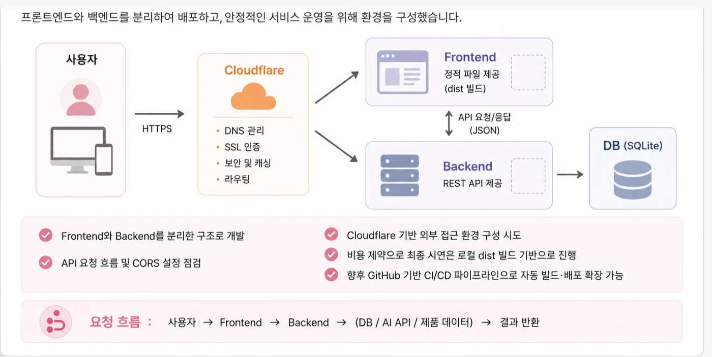

# Lumière — 퍼스널컬러 진단 · 화장품 추천

> 진단은 받아도 “그래서 뭘 사야 하나”로 이어지지 않습니다. 진단과 추천 사이의 빈 칸을 메운 서비스입니다.

| | |
|---|---|
| 기간 | 2026.05 – 06 · SSAFY 관통 프로젝트 |
| 팀 | 2인 |
| 나의 역할 | AI 설계 · 클라우드 아키텍처 · 배포 · 트러블슈팅 |
| 산출물 | 설계 문서 7종 (아키텍처 · AI 구현 · 추천 근거 · ERD · 스토리보드 · 와이어프레임 · 요구사항) |

`Personal Color AI`  `FastAPI`  `Cloudflare Tunnel`  `추천`

[GitHub ↗](https://github.com/bada0310/Lumiere)

## 개요

### Problem

퍼스널컬러 진단 서비스는 많지만, 결과가 **구매 행동으로 이어지지 않습니다.** “당신은 여름 쿨톤입니다”에서 끝나고, 그 톤에 맞는 제품을 찾는 건 다시 사용자 몫이었습니다.

그래서 진단 모델의 출력을 **추천의 입력으로 그대로 쓸 수 있는 형태**로 설계하는 것이 과제였습니다.

### 나의 활동 — 붙이기 전에 계약부터

2인 팀이라 각자 맡은 모듈을 나중에 합치는 방식이면 반드시 어긋납니다. 그래서 코드를 쓰기 전에 **모델이 무엇을 내보내고 서버가 무엇을 받을지 먼저 문서로 확정**했습니다.

남긴 문서: 아이디어 정리 · 요구사항 정리 · `Cloud Architecture Design Document` · 퍼스널컬러 AI 구현 문서 · 추천시스템 AI Pick 설계 근거 문서 · 스토리보드 · 와이어프레임 · ERD.

**이 순서 덕분에** 모델 쪽 정확도를 손보는 동안에도 서버 쪽은 멈추지 않고 갈 수 있었습니다.

### 핵심 성과 · Key Achievements

- **배포마다 고치던 3곳 → 0곳** 재시작마다 바뀌던 ngrok 주소를 **Cloudflare Tunnel 고정 도메인**으로 전환. 손대야 하던 지점은 프론트 `.env` · OAuth Redirect URI · 백엔드 CORS 세 곳이었습니다. 주소가 상수가 되면서 이 경로의 장애가 사라졌습니다

- **증상 4종을 6단계로 분해** 배포 로그 → 기본 실행 URL → 공개 URL → 프론트 요청 주소 → 서버 도달 → CORS·host **6단계 체크리스트**를 만들어, 증상 4종(`ERR_FAILED` · `ERR_NAME_NOT_RESOLVED` · 404 · CORS)이 **같은 원인**임을 특정했습니다. 이후 같은 증상은 매번 이 순서로 잡혔고 **트러블슈팅 문서 6건**이 쌓였습니다

- **코드보다 스키마를 먼저 확정** 2인 팀에서 각자 만들고 나중에 합치는 방식을 피하려고, 코드 이전에 **모델의 출력 스키마와 서버의 입력 스키마를 문서로 확정** — 모델 정확도를 손보는 동안에도 서버 작업이 멈추지 않았습니다

성과 1건 더 보기

- **빌드와 배포의 분리** ‘포장(Build)’과 ‘보내기(Deploy)’가 독립 단계임을 정리해 오류가 어느 단계 것인지 구분 가능해졌고, 이 구분이 이후 **DERO의 Jenkins 파이프라인 설계**로 이어졌습니다

## 기술 의사결정

### 기술 의사결정

Q. 로컬 서버를 왜 굳이 외부에 노출했나

클라우드 비용을 쓸 수 없는 2인 프로젝트였습니다. 그런데 **로컬에서는 외부 API 콜백을 받을 수 없고**, 프론트와의 사전 통합 테스트도 불가능해서 **매번 배포한 뒤에야 확인**하는 병목이 있었습니다.

그래서 터널링을 도입했습니다. 프론트는 Cloudflare에 두고, API Base URL만 터널 주소로 잡아 로컬 백엔드(`:8000`)로 흘렸습니다.

**감수한 것** 로컬 머신이 꺼지면 서비스도 멈춥니다. 데모·검증 단계에서만 성립하는 구조라는 걸 알고 썼습니다.

Q. ngrok에서 Cloudflare Tunnel로 갈아탄 이유

처음엔 ngrok을 썼습니다. 붙는 건 빨랐는데 **서버를 재시작할 때마다 공개 주소가 바뀌었습니다.** 주소가 바뀌면 갱신해야 할 곳이 세 군데였습니다.

- 프론트엔드 `.env` 의 `REACT_APP_API_URL` — 바꾸고 서버 재시작까지

- 소셜 로그인 **OAuth Redirect URI** — 카카오·구글 개발자 콘솔에 등록된 주소

- 백엔드 **CORS 허용 목록**

하나만 빠뜨려도 `net::ERR_FAILED` · `ERR_NAME_NOT_RESOLVED` · 404 · `CORS Policy Blocked` 중 하나가 났습니다. **증상이 네 가지라 원인도 네 가지인 줄 알았는데, 전부 같은 원인이었습니다.**

그래서 **Cloudflare Tunnel 고정 도메인**으로 옮겼습니다. 주소가 상수가 되니 세 군데가 **한 번만 설정하면 되는 값**이 됐습니다.

**배운 것** 휴먼 에러를 줄이는 방법은 “조심하기”가 아니라 **바뀌는 값을 안 바뀌게 만드는 것**이었습니다. 그 전까지는 체크리스트를 더 꼼꼼히 쓰는 쪽으로 해결하려 했습니다.

Q. 2인 팀에서 모델과 서버를 어떻게 나눴나

둘이서 각자 맡은 걸 만들고 나중에 합치면 반드시 어긋납니다. 그래서 **코드를 쓰기 전에 데이터 계약을 문서로 확정**했습니다 — 퍼스널컬러 진단 모델이 무엇을 내보내고, 추천 로직이 무엇을 받을지.

**얻은 것** 모델 쪽 정확도를 손보는 동안 서버 쪽이 멈추지 않았습니다. **치른 것** 초반 일주일을 문서에 썼습니다. 2인 6주 일정에서 적지 않은 비중이었고, 당시엔 이게 맞나 싶었습니다.

Q. 빌드와 배포를 왜 나눠서 이해해야 했나

처음엔 **“코드만 올리면 돌아가겠지”** 라고 생각했습니다. 그래서 배포 오류가 날 때마다 어디를 봐야 할지 몰랐습니다.

**포장(Build)**은 정적 파일로 압축·최적화, **보내기(Deploy)**는 그걸 Cloudflare에 올리는 단계. 둘이 **독립**이라는 걸 안 뒤로 오류가 **어느 단계 것인지** 구분됐습니다.

**남은 것** 원시 코드가 그대로 올라가는 게 아니라 **통제된 환경에서 최적화된 결과물만** 서버에 간다는 감각. 이후 DERO의 Jenkins 파이프라인을 짤 때 빌드 단계와 전환 단계를 처음부터 분리해 설계한 건 여기서 왔습니다.

## 아키텍처

### Architecture

***배포 구성** — 엣지는 Cloudflare에 맡기고 서비스는 로컬 서버 뒤에 두었다. 감수한 것 — 비용 제약으로 최종 시연은 클라우드가 아니라 로컬 dist 빌드 기반으로 진행했다. 발표자료 · 기술 스택 및 협업 방식.*

[엣지] Cloudflare — DNS · TLS · 캐시 · **Tunnel** [프론트] Vite localhost:5173 [백엔드] FastAPI 127.0.0.1:8000 [서버] 로컬 Linux 머신 (상시 구동)

클라우드 비용 없이 공개 주소를 확보해야 했습니다. 로컬 서버를 두고 Cloudflare Tunnel로 끌어냈습니다.

## 트러블슈팅

### Troubleshooting — 주소가 바뀔 때마다 연동이 끊겼다

증상

배포할 때마다 프론트에서 `net::ERR_FAILED` · `ERR_NAME_NOT_RESOLVED` · 404 · CORS가 번갈아 났습니다.

처음 가설

CORS 설정 문제로만 봤습니다. **틀렸습니다** — 네 가지 증상의 원인이 전부 달랐습니다.

실제 원인

ngrok의 **공개 주소가 재시작마다 바뀌는 것**이 근본 원인이었습니다. 주소가 바뀌면 갱신해야 할 곳이 **세 군데**인데 하나씩 빠뜨리고 있었습니다.

어떻게 찾았나

장애 1차 대응 6단계를 만들어 위에서 아래로 훑었습니다 — 배포 로그 → 기본 실행 URL → 공개 URL → 프론트 요청 주소(F12 Network) → 서버 도달(상태코드) → CORS · host.

해결

**Cloudflare Tunnel 고정 도메인**으로 전환. 주소가 상수가 되니 갱신 지점 세 군데(프론트 `.env` · OAuth Redirect URI · 백엔드 CORS 허용목록)가 한 번만 설정하면 되는 값이 됐습니다.

배운 것

증상이 네 가지라고 원인이 네 가지는 아닙니다. **바뀌는 값을 고정값으로 만드는 것**이 네 증상을 한 번에 없앴습니다.

## 회고

### Retrospective

배운 점

**빌드(포장)와 배포(보내기)는 다른 일**이라는 걸 여기서 몸으로 배웠습니다. 빌드가 됐는데 안 열리는 상황을 겪고 나서야 구분이 생겼습니다.

다음에는

외부 터널을 쓸 때 **주소를 먼저 고정**하고 개발을 시작합니다. 임시 주소로 시작하면 갱신 지점이 늘어나기만 합니다.

## 기술 스택

| | |
|---|---|
| Frontend | React · Vite |
| Backend | FastAPI · Python |
| Infra | Cloudflare Pages · Cloudflare Tunnel · 로컬 Linux 서버 · ngrok(초기) |
| AI | 퍼스널컬러 진단 모델 · 추천(AI Pick) 설계 |

---

전체 포트폴리오 → **https://sungeun-portfolio.vercel.app/projects/lumiere**
